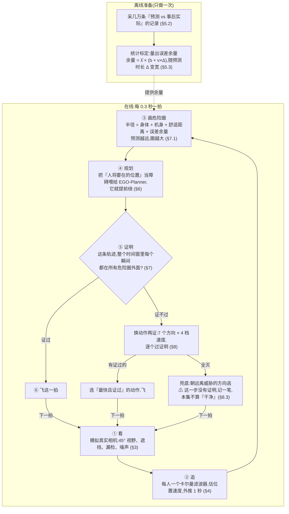
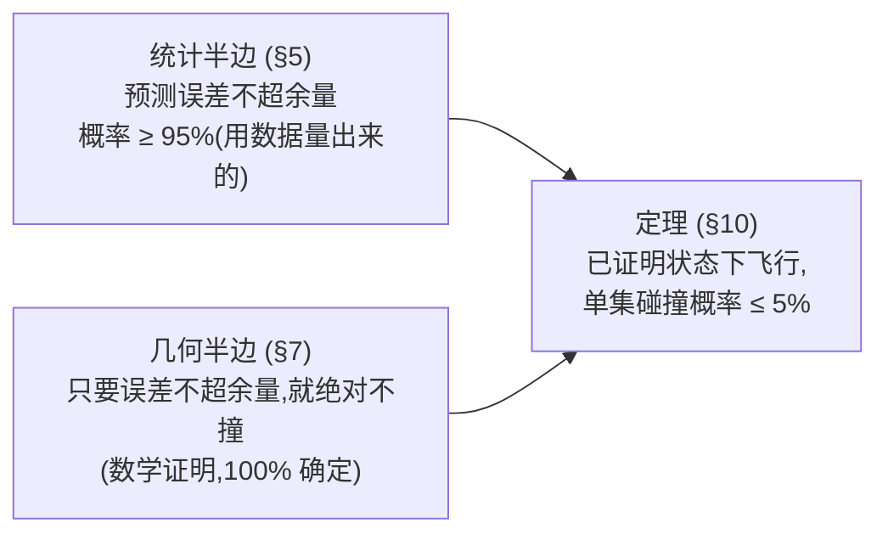

# 带安全证明的无人机街道飞行系统:它是怎么做的(论文初稿)

> sando-core · 2026-07-11。
> 这份稿子讲清楚两件事:**系统怎么实现的,算法具体怎么工作的**。
> 所有内容按代码现状写(分支 `feat/bernstein-gate`),每节标出源文件。
> 所有数字都经过代码核查;来自实验记录、代码验不了的,会标"台账数字"。

---

## 目录

1. [要解决什么问题](#1-要解决什么问题)
2. [系统一眼看懂](#2-系统一眼看懂)
3. [眼睛:模拟真实相机](#3-眼睛模拟真实相机)
4. [追踪:预测每个人接下来去哪](#4-追踪预测每个人接下来去哪)
5. [预测会错:错多少,用数据量](#5-预测会错错多少用数据量)
6. [规划:绕开"人将要在的地方"](#6-规划绕开人将要在的地方)
7. [安全证明:飞之前先证明不会撞](#7-安全证明飞之前先证明不会撞)
8. [决策:证不过怎么办](#8-决策证不过怎么办)
9. [执行:三种测试环境](#9-执行三种测试环境)
10. [总保证:为什么敢说碰撞概率不超 5%](#10-总保证为什么敢说碰撞概率不超-5)
11. [给强化学习也套上同一道关卡](#11-给强化学习也套上同一道关卡)
12. [成绩单](#12-成绩单)
13. [正在做的新方案](#13-正在做的新方案cpl-v3)
14. [诚实清单](#14-诚实清单)
- [附录 A:关键常数](#附录-a关键常数)
- [附录 B:现役开关组合](#附录-b现役开关组合)
- [附录 C:术语对照](#附录-c术语对照)

---

## 1. 要解决什么问题

一架小无人机,在有行人和车的街道上,从起点飞到终点。

- 无人机:半径 0.25 米,最快 3 米/秒,最大加速度 6 米/秒²。
- 行人和车按真实轨迹走,**不会给无人机让路**。
- 传感器是"真实"的:只看得见前方 45° 内、10 米内的东西,会被挡、会漏检、有噪声,
  而且认不出"这个人是刚才那个人吗"。

**考核标准叫"干净抵达"**。一集要同时做到三条:

1. 到了终点(水平距离小于 0.8 米就算到,不管高度);
2. 全程没撞(撞 = 无人机中心进了某个人/车的身体圆柱;每 0.3 秒查一次);
3. 全程没用过"兜底动作"(证明不了安全、只能硬逃的那种动作,一次都没用)。

**核心思路一句话**:先预测每个人接下来一秒会在哪 → 让路线提前绕开那些地方 →
起飞前用数学**证明**"接下来这一小段,每一个瞬间都不会撞" → 证过才飞。
证不过就换更保守的动作再证。全都证不过,才用没有保证的兜底动作,并且记下来。

**和普通避障的区别**:普通系统是"尽量绕,撞不撞看运气"。
这个系统在规划器外面加了一道**独立的数学关卡**,并且整个系统合起来有一条定理:

> 只要测试场景和标定场景是同一类,**"在已证明状态下飞行时撞上"的概率不超过 5%**。
> (实测:已证明状态下零碰撞。剩下的碰撞都来自传感器物理上看不见的方向,
> 而且"全知对照"也躲不掉。见第 14 节。)

**三种测试环境**(叫"测量面",数字不能混用):

| 测量面 | 是什么 | 用途 |
|---|---|---|
| 回放面 | 在录好的真实人群轨迹上离线重放,快 | 日常调试、标定 |
| 真引擎面 | MetaUrban 物理引擎在线跑,慢 | 结论复核 |
| 渲染面 | 带画面、带真四旋翼物理,出视频 | 演示、取证 |

---

## 2. 系统一眼看懂

先离线做一次准备(量出预测误差有多大),然后在线每 0.3 秒(一"拍")跑一圈下面的环。
节点上标了节号,想看细节按号跳:



一句话版:**看 → 追 → 画圈 → 绕 → 证 → 飞;证不过就换动作,全灭才兜底逃。**
下面每一步一节。

---

## 3. 眼睛:模拟真实相机

代码:`metaurban/perception.py`。三个测量面共用同一份,规格照 Intel D435i 深度相机。

每一拍,对场上每个人/车做四道检查,全过才算"这拍看见了":

**看得到的范围**。前方 45° 锥,10 米。
距离按**身体表面**算,不按中心:一棵半径 4.7 米的树,中心在 10 米外、树冠却在眼前——
按中心算就整场"看不见这棵树"。以前真出过这事:传感器一直看不见一棵树,
无人机拿着安全证明撞了上去。错在传感器模型说谎,不在证明,已修。
方向角仍按中心算;但无人机已经钻进大物体的脚印里时,无条件算看得见。

**挡住了看不见**。中间有别的东西,就看不见。但判"挡没挡"不能只看中心一个点——
相机看到的是整个身子的轮廓。所以在目标朝向相机的一侧取 5 个点,
**只要有一个点没被挡、又在视野里,就算看得见**。这也是防"传感器说谎"的修正。

**漏检**。越远越容易漏:漏检概率 = 0.05 + 0.15×(距离/10)²。

**噪声**。位置有误差,越远越大:标准差 = 0.05 + 0.01×距离(米)。尺寸估计误差约 5%。

**认不出身份**。检测不带"这是几号人"的标签。哪个检测属于哪条轨迹,用"就近配对"猜:
配对门限 1.2 米;刚出生的轨迹还不知道速度,门限放宽到 1.2 + 3 米
(不放宽,快车永远配不上,会不停生出幽灵轨迹)。
两个人交叉走过,身份**可能**认错;被挡一阵,一个人**可能**裂成两条轨迹——
这些都是刻意保留的真实缺陷。

**轨迹的生死**。这一拍没配上,轨迹不删,先"滑行"(按惯性猜它去哪了)。
滑行满 8 拍还配不上,才删。
**重要例外**:没确认过的轨迹(只见过一两三次)只准滑行 2 拍。
为什么:见过一两次的"疑似目标"多半是噪声,却会在滑行期按最坏情况膨胀成一个大毒圈,
把路全堵死。改成 2 拍后,兜底逃跑次数降了三成(回放面 −29%,真引擎面 −36%,台账数字)。
这个开关叫 `YOUNG_TTL=2`,是现役配置,代码默认关。
**另一个例外**:静物(树、杆子)看见过就永远记住,位置冻结不删——建过的图不能被遮挡抹掉。

---

## 4. 追踪:预测每个人接下来去哪

代码:`metaurban/kf_tracker.py`。每条轨迹一个卡尔曼滤波器。

**它是什么**:一个不断修正的估计器。每来一次检测,就更新对这个人的位置、速度、加速度的估计;
没来检测,就按惯性外推,同时把"我不确定"的程度调大。

几个实现要点,都很朴素:

- x、y 两个方向各一个滤波器,状态是 [位置, 速度, 加速度]。高度不滤(人不飞)。
- 离散化是数学精确的:三个 0.1 秒步和一个 0.3 秒步结果一致(测试验证到小数点后 12 位)。
  所以不同环境用不同节拍,模型不变形。
- **第一次见到一个人,不假装知道他的速度**。旧版把速度初始化成"0,而且很确定",
  快车的第二次检测就会把滤波器搞疯。现在第一次只记位置,速度标成"完全不知道";
  第二次检测用两点相减直接算出速度。
- 估出来的加速度限制在 ±2 米/秒²(时间一长,加速度项噪声太大)。

**给下游的预测**:一条抛物线 `c(t) = 位置 + 速度×t + ½×加速度×t²`。
但**实际部署用直线**(加速度当零,即匀速外推)。原因有两个:
第 5 节的误差标定就是对匀速预测量的,预测器和标定必须是同一个;
而且对走走停停的行人,匀速反而比带加速度的更准。

**成熟度**:见过 2 次才算"能用"(速度才有意义);见过 4 次才算"成熟"。
成熟不成熟,决定用哪套误差余量,也决定精细功能信不信它。

---

## 5. 预测会错:错多少,用数据量

预测一定会错。关键是错多少。**我们不假设,直接量**。
这套方法学名叫 conformal(保形预测),现行第三代实现在 `metaurban/calibrate_v3.py`。

### 5.1 量出来的东西长什么样

给每类目标一条"误差上限随预测时长变宽"的直线:

```
成熟目标:  余量(Δ) = λ̂ × (b + v×Δ)        Δ = 往后预测多少秒
新目标:    余量(Δ) = λ̂ × b_y + 物理速度帽 × Δ
静物:      余量(Δ) = λ̂ × b_s               (不随时间变宽)
```

b、v 是形状(截距和斜率),λ̂ 是一个总缩放系数。第 7 节的危险圈半径就用这个余量。

**它保证什么**:只要新场景和标定场景是同一类(同一个世界、同一套传感器规律,只是换随机数),
那么**一整个航次里,所有预测误差全部不超余量的概率 ≥ 95%**(ε=0.05 档)。
不用假设误差是什么分布。

### 5.2 数据怎么采

代码:`metaurban/harvest_v2.py`。要点:

- **在真实条件下采**:真实相机模型全开、完整系统在环飞行、预测器就是部署那个(匀速外推)。
  认错人、漏检、滑行造成的误差,全都算进去。
  (诚实申报:采数据的航次飞的是默认版决策层,不是现役版——差别属于统计假设的一部分,论文明写。)
- 每拍、每条轨迹、22 个预测时长(0 到 1.05 秒,每 0.05 秒一档)各记一行:
  误差 = 实际位置和预测位置差多少米。
- **只有"够得着无人机"的记录才参与保证**:那个人在未来 1 秒内以最大速度也够不到无人机的,
  不算数(真肇事者一定满足"够得着",所以这样筛不漏真危险)。
- 配对模糊的记录整行扔掉(最近的人要够近、第二近的要够远,才敢说配对没错)。
- 防作弊:场景池、种子、规则全部提前注册加密码锁,改一个字节就拒跑。

### 5.3 λ̂ 怎么定

三步:

1. **形状先冻结**。在一份独立的设计数据上,把每类的 (b, v) 拟合好、锁死。
   实拟:行人 (0.31, 1.00),车 (0.39, 1.00),静物 0.27,新目标截距约 0.42–0.44,
   物理速度帽:行人 2.2、车 11.0 米/秒。
2. **每行记录打一个分**:分数 = 误差 ÷ 形状给的值(成熟目标),或者
   (误差 − 速度帽×Δ) ÷ 截距(新目标)。分数大 = 这条预测错得离谱。
3. **每个航次取最大分,再取排名**。标定折共 47 个入账航次
   (实飞 69 个,22 个一行记录都没产生、不入账;有记录但没有合格行的记 −∞、照样入账)。
   按公式 k = ⌈(n+1)(1−ε)⌉ 取第 k 小的分数做 λ̂。
   实跑:**λ̂ = 1.623(ε=0.10 档)/ 3.164(ε=0.05 档)**。

**为什么这样设计**:所有"估不准"的风险都被 λ̂ 一个数吸收,而 λ̂ 是排名统计量——
**形状拟错了只会让余量变宽(多花钱),绝不会让 95% 的保证变假(不撒谎)**。
新目标的斜率钉死在物理速度帽上、永远不乘 λ̂,是为了堵前代的一个事故:
新目标的分数把排名劫持了,全体余量跟着爆炸。

**验收**:留出的测试折上,航次覆盖率 0.969(ε=0.10,要求 ≥0.90)、1.000(ε=0.05,要求 ≥0.95),双档合格。

### 5.4 发布的数字(现行 calib_v3.json)

| 类别 | ε=0.10:截距/斜率 | ε=0.05:截距/斜率 |
|---|---|---|
| 行人·成熟 | 0.50 / 1.63 | 0.97 / 3.17 |
| 车·成熟 | 0.63 / 1.62 | 1.22 / 3.16 |
| 静物 | 0.44 / 0 | 0.85 / 0 |
| 行人·新 | 0.69 / 2.2(恒) | 1.34 / 2.2(恒) |
| 车·新 | 0.71 / 11.0(恒) | 1.39 / 11.0(恒) |

对比前一代:行人余量瘦了三分之一;车辆新目标的截距从 20.33 米(荒谬)修到 0.71 米。

### 5.5 三代演进,一段话

一代:所有记录混一起取分位数,一条全局直线(这份文件渲染面和强化学习盾还在用)。
二代:按类别、成熟度细分组,每组还要估一个离散度 σ——σ 五次闯祸,组太多数据不够。
三代(现行):**把 σ 整个删掉**,冻结形状 + 单个 λ̂,如上。
四代:已做完待命,和新决策层(第 13 节)一起上。

---

## 6. 规划:绕开"人将要在的地方"

规划器用浙大开源的 EGO-Planner,剥掉 ROS 编译成独立库(`ego/` + `metaurban/ego_bridge.py`)。

**规划核心一行没改**(初始化、B 样条、碰撞回弹优化、可行性检查都是原装)。
改的只有它的"地图"模块:换成了一个 17 行的极简版——每帧整张重建,喂进什么点云就当什么障碍,
不做历史融合。格子 0.2 米,障碍再膨胀一圈(回放面 0.45 米、渲染面 0.3 米、真引擎面 0.1 米)。

**关键动作是喂什么**。不喂"人现在在哪",喂"人将要在哪":

- 默认:把每个人的匀速预测位置(现在 + 0.3 秒后两帧)各放一圈圆柱面采样点
  (一圈 36 个点)。
- 更聪明的放法(现役开启,`CPA_CLOUD=1`):算出"这个人和无人机相对距离最近的时刻",
  把圆柱放在**那个时刻**他会在的位置。规划器于是学会从预测的空隙里穿过去,
  而不是绕开人现在站的地方。干净抵达 +4.1 个百分点(台账数字)。
  **只对成熟轨迹这么干**:信了刚出生轨迹的错误速度,真撞过一次。

**两个要点**:

- 规划失败(比如离终点太近)不会清掉上一条已承诺的轨迹——旧轨迹继续有效,
  这是"规划失败就继续飞旧承诺"的基础。
- 喂给规划器的障碍半径**故意比证明用的小**(不加余量)。把余量也喂进规划,
  会在规划层把路全堵死,实测更差。规划激进一点没关系,后面有证明关卡兜着。

---

## 7. 安全证明:飞之前先证明不会撞

核心部件。代码:`cpp/include/sando_cpp/bernstein_cert.hpp`(C++,459 行)。

### 7.1 要证明什么

对每个人/车,画一个**危险圈**,半径是:

```
R(t) = 身体半径 + 0.25(机身) + 0.10(舒适距离) + q(标定截距)
       + 斜率 × (t + δ)          ← 预测越远圈越大;δ 是"观测已经旧了多久"
```

要证的命题:**在接下来的时间窗内(约 0.75 秒),轨迹的每一个瞬间都满足——
要么水平方向躲开这个人的危险圈(按预测动的圈和冻结在原地的圈都要躲开),
要么飞得比他的头顶净空面还高**。对每个人都成立,才算证过。

头顶净空面 = 身高 + 伸手 0.30 + 机身 + 垂直舒适 0.30 + q。
这个面**不随时间变大**(人不会飞,垂直方向速度是零,固定面就够了)。

### 7.2 怎么证:一个多项式技巧

轨迹是多项式。人的预测位置也是多项式。所以"距离的平方"还是一个关于时间的多项式。

把"危险半径的平方 − 距离的平方"记作 D(t):D(t) ≤ 0 就是安全。
把 D(t) 换一种数学上等价的写法(Bernstein 形式)后,有一条好性质:

> **整段时间里 D(t) 的值,不会超过它那串系数里最大的一个。**

所以:**系数全部 ≤ 0,就证明了整段时间都安全**。
一次代数检查,管住区间里**无穷多个瞬间**——不是抽查几个时间点(抽查会漏)。

补充三件事:

- 系数有正的,不一定真危险,可能只是这个界太松。这时把时间段**对半切**再各自检查,
  越切越贴近真实曲线,最多切 16 层。
- 危险圈随时间变大,所以"半径平方"也是个二次多项式。必须**先把 D(t) 整个组装好、再切**;
  先切距离再和固定半径比,对变大的圈是错的(这是实现里最容易做错的一步)。
- 只需要证到时间窗为止:窗外的部分用"切左半边"的办法精确裁掉。
  窗内一段轨迹都没有?那就返回"没证明"——什么都没证不等于安全。

### 7.3 浮点数不说谎

所有运算都带着一个"误差信封":每算一步,结果向两边各推一个最小浮点单位。
判定用最保守的那一边。效果:**算出来"安全"就真是安全**。
浮点误差只可能让证明拒绝一个其实安全的轨迹,绝不可能放行一个危险的。

### 7.4 三种答案

除了"证过/没证过",还能给第三种答案:如果 D(t) 的系数**下界**在某段上全是正的,
那就是数学证明了"这条路确实被堵死",不是"证明力度不够"。
于是每次检查可以回答:**安全 / 确实堵死 / 不知道**。
"不知道"才值得花更多预算细分重试。这个三值出口目前只在回放面当诊断用,不驱动决策。

### 7.5 不挑规划器

证明核吃统一格式:"每段轨迹的 Bernstein 控制点"。
EGO 的三次 B 样条每段乘一个固定小矩阵就精确变成这种格式(不引入任何松弛);
自研的五次多项式也一样能喂。同一个证明核跑两种规划器,就是"这道关卡不挑规划器"的字面证明。

**速度**:一次检查约 7 微秒(微基准台账)。一拍里几十个候选、每人三次检查,毫无压力。

---

## 8. 决策:证不过怎么办

代码:`metaurban/safety_layer.py`,三个测量面共用(渲染面传自己的速度档表)。每拍:

### 8.1 备选动作是一张网格

**方向** 7 个:直行、左偏 25°、右偏 25°、左偏 50°、右偏 50°、飞越、原地爬升。
每个方向让规划器规划一条(贵的操作)。

**速度** 4 档:全速、0.6 倍、0.3 倍、0.15 倍。
同一条轨迹,慢点飞算另一个候选(便宜:不用重新规划,证明时做个数学代换就行——
"我慢一半飞"等价于"我原速飞、全世界快一倍",喂同一个证明核)。
0.15 倍是"爬行挡":全速证不过时还能认证地慢慢挪,不至于停在原地当靶子。

**慢有慢的好处(现役开启,`TAU_SPEED=1`)**:飞得慢,刹得住的时间就短,
证明需要覆盖的时间窗就短,危险圈长得就少,就更容易证过。
公式:窗 = 0.30 + 0.5×速度档 + 0.05 秒。
"降速换可证明性"成了一个连续的杠杆——这一条加上爬行挡,是整场调优里单笔最大的收益
(回放面干净抵达 +13.9 个百分点,台账数字)。

### 8.2 怎么选赢家

**先比速度档,再比进度**:全速的绕行胜过任何减速的直行(只看短期进度会选"慢而直",
然后一直慢下去)。全速直行证过,直接收工。

**别来回改主意**:选定的方向有"在位者优先权"——目标点定在世界坐标里,没走到就接着飞;
速度降档立即生效,升档每拍最多升一格(刹车不能等,松刹要缓)。
每 3 拍才允许试一次"换回更直的路",而且要过**加严的证明**才准换
(把"观测新鲜度"再加严 0.15 秒,圈更大)——防止边缘证书把无人机从刚承诺的绕行里拽出来。

**要逃趁早(现役开启,`ESC_TRIG=1`)**:前方有人越逼越近(净空小于 2.5 米、
还在以每秒 0.8 米收缩)时,把逃逸类动作排到候选队首。只改顺序,证明照做——
道理:等包围圈合拢,什么都证不过了;逃要趁还证得过的时候。

**收尾的严谨性**:比选过程会覆写规划器手里的轨迹。赢家如果不是最后规划的那条,
要重新规划、**重新证明**;重证失败就落兜底。绝不飞没重证过的轨迹。

### 8.3 兜底(evade)

所有候选全灭,才走这步:朝离最近威胁相反的方向全速逃(水平方向;爬升靠位置指令带)。
只逃看得见的目标——逃看不见的等于开天眼作弊。
**这一步没有任何证明**,每用一次记一笔,这一集就不算"干净"。
渲染面里这一步改成原地悬停(街边全是静物,盲逃更危险)。

---

## 9. 执行:三种测试环境

**回放面**:无人机是个点。沿承诺轨迹取 0.3 秒后的位置当目标;
减速档就是把时间轴拉长:位置取 s×0.3 秒处,速度乘 s,加速度乘 s²。

**真引擎面**:MetaUrban 引擎推物理,无人机用加速度指令跟踪轨迹上的参考点。
一个细节:参考点要取"轨迹上离我最近的点再往前 s×0.3 秒",
不能从轨迹起点算(否则零速起步时参考点永远钉在起点,整集不动,真出过这 bug)。
还有个诚实技巧:这个环境的碰撞判定是纯平面的,飞高了也算撞。
所以给证明的圆柱高度写成 50 米,让"飞越"永远证不过——平面世界里从头顶过就是作弊。

**渲染面**:真四旋翼模型(质量 0.95 kg、PD 控制、倾角限 55°、姿态响应延迟 60 毫秒)。
决策每 0.1 秒,物理每 0.02 秒。两件值得写的事:

- **刹停别猛拉**。悬停保持的老实现是"速度目标清零",6 米/秒的动量一步全要刹掉,
  机头猛栽。新实现(`HOLD_DECEL=1`):目标点跟着当前速度放,每步只要求减掉一半,
  等效一个平滑的指数刹车。结果:姿态猛烈度大降,净空反而更大,还快 2.3 秒——
  平顺不但免费,还倒贴(过冲后的来回修正消失了)。
- **证的是计划,飞的带惯性**。四旋翼跟不上计划的误差,量出来是 0.473 米(百分之一分位),
  直接加进危险圈半径。另有一道闸:用当前真实状态往前仿真 1.2 秒,
  把"实际会飞出的路径"再对所有障碍查一遍距离。

---

## 10. 总保证:为什么敢说碰撞概率不超 5%

代码:`metaurban/phase5_compose.py`。两个半边拼起来:



- 统计半边(第 5 节):预测误差不超余量,概率 ≥ 95%;
- 几何半边(第 7 节):误差不超余量,就**绝对**不撞。

拼接的推理很短:碰撞如果发生在某次证明之后的 0.4 秒内,那个肇事者当时一定就在附近
(0.4 秒内物理够得着的范围),而且他的预测误差一定超了余量——否则几何半边排除了碰撞。
所以"已证明状态下撞"的概率 ≤ "附近有人误差超余量"的概率 ≤ 5%。

**让定理能用的关键:重新证明的节奏**。
如果余量要管住 0.85 秒的预测误差,余量要 6.99 米——无人机根本没法动。
但系统每 0.3 秒重新证明一次,任何碰撞前 0.4 秒内一定刚证过,
所以**余量只需要管 0.4 秒**:6.99 米 → **1.45 米**,缩小近 5 倍。
(留出组验证覆盖率 0.925@ε=0.05;样本 40 集,偏少,如实报。)

**三本账,防止"证一半冒充全证"**:

1. 已证明飞行 → 上面的 5% 保证;
2. 规划失败、沿飞旧承诺 → 发生频率可测量,按频率单独摊;
3. 兜底逃跑 → **没有保证**,按次数如实报(能证过的都轮不到它,这是结构性的)。

细节口径(按代码,论文要写准):统计的"同一类"单位是**场景**(episode 聚在场景里,
按 episode 切会泄漏);斜率取自独立数据的 90 分位点直线拟合,保证全部由截距的排名承担;
产物日期字段是硬编码的,以晋升件 calib.json 的 07-04 为准。

---

## 11. 给强化学习也套上同一道关卡

代码:`metaurban/shield.py`。目的:证明这道关卡**不挑控制器**——套在纯强化学习策略外面也有效。

机制比主线简单(如实区分):不调连续时间证明核,而是逐拍检查——
把这一拍的指令速度往后匀速推 0.75 秒,在 16 个时间点上和每个人的危险圈比。
三级响应:动作安全就放行;不安全就在 32 个备选速度里挑一个安全的、最顺路的;
全不安全就刹车——**刹车没有认证**,如实计数上报。
地面机器人版把直线换成圆弧,结构相同。

结果(台账数字):碰撞 6.75% 对 14.25%(开盾/关盾,400 集,p=0.0007),开盾还到得更多。

---

## 12. 成绩单

每个数字都标测量面。百分比类是台账数字。

**回放面(每档 345 集)**:

| 配置 | 干净抵达 | 兜底次数 | 碰撞 |
|---|---|---|---|
| 起点(一代标定) | 51.0% | 1290 | 0 |
| **现役(V11)** | **68.4%**(到达 95.1%) | **531** | **0** |
| 视野内全知(天花板) | 78.3% | 260 | — |
| 360° 全知 | 69.3% | 178 | — |

- 多余的兜底压掉了 59%,同时保持零碰撞——安全不是靠疯狂急刹。
- 天花板按 78.3% 算:同样的眼睛、完美的预测。剩下的差距主要是"迎面 3–4 米内的行人,
  诚实的余量就是要这么宽"。
- 有趣:360° 全知反而比 45° 全知**更多**兜底——看得见侧后方来车就会提前躲。
  信息更多不等于更安稳,论文可以讨论。

**真引擎面**:现役栈干净抵达 64.3%,和回放面同口径数字精确互证。
20 集验收共 7 次碰撞,其中 **6 次全知对照也在同一集死**(出生点旁被车碾、高速横穿,物理无解)。
真正欠感知栈的,只有 1 条命。

**对原生 EGO(1216 集台账)**:真实感知下碰撞 1.3% 对 5.9%;全知各组 0 撞 0 险情;
反应余量 2.7 倍(最小碰撞时间 0.59 秒对 0.22 秒);代价:慢 5.7%。
诚实项:动作"猛度"(加加速度)原生更优——我们的规避还是更猛,根治靠第 13 节。
渲染面有成片:弯道图上原生撞毁、我们 0.83 米净空安全到达。

---

## 13. 正在做的新方案(CPL-v3)

代码:`metaurban/local_lattice.py`。

**动机**:第 8 节的决策层是"离散挑选"焊在连续规划器上,接缝天然会犹豫、抖。
根治思路:**不挑了,直接在"已被证明安全的轨迹集合"里做规划**,挑选降为兜底。

**做法**:每拍生成一批 1.5 秒的候选轨迹(13 个方向 × 5 档速度 × 高度层,加悬停/爬升等)。
每条候选变成一个"三段套餐":

```
只飞前 0.3 秒  +  接一段刹停曲线  +  停稳后再保持 0.05 秒
```

**整个套餐一次证明**。含义:无论何时,手里都握着一条"已被证明能安全停下来"的完整退路
(术语叫递归可行性)。哪怕下一拍全世界都证不过,继续执行手里这条套餐的刹停部分,
也在证明范围内。评分:先比进度,再比净空,最后比平顺。

**现状**:可靠性已锁死(一万个场景零假证明)。但代价量化出来很重:
"随时能刹停"意味着刹停全程约 0.65 秒都要在危险圈外,而圈在这段时间一直在长——
算下来行人 1.7~2.7 米内**连悬停都证不过**(旧决策层可以 0.10 米贴身而过)。
到达率从 8/8 掉到 1/8。三个修法方向已定(圈别按最坏速度长、"完全停"松成"减速到能重证"、
提前主动飞越),和第四代标定配套一起转正。**现役暂不替换。**

---

## 14. 诚实清单

**物理上躲不掉的,承认躲不掉**。剩余碰撞几乎全是:45° 视野外、8.3 米/秒的侧后方快车,
而无人机只有 3 米/秒。给它开全知也一次没躲掉——1.9 秒预警加 3 米/秒的腿,
对 8.3 米/秒的横扫无解。单传感器设定下这是物理边界,写进失效包络,不再追。

**保证有边界**。兜底逃跑没有保证(如实计数);保证只对"同一类场景"成立,
换世界要重新标定;标定的节拍必须和部署一致(早期最大的坑);
认错人的极端情形在保证之外(模糊配对的记录被丢弃)。

**三个测量面没完全对齐**。渲染面只读一代标定文件,二三代标定和爬行挡在渲染面**不生效**——
所以演示视频不能当评测证据。喂规划器的半径和证明用的半径故意不一致(见第 6 节)。

**死开关清单**(代码考古,防止误引):`NIS_GATE` 在回放面和真引擎面都打不响
(对象缺一个属性,恒为 0);`CALIB_EPS` 在回放面不被消费,回放面实际用 ε=0.05 档;
CPL-v3 的速度信任窗算了没用;地面盾的备选集里没有减速弧(系数全正,减速分支永远走不到);
决策函数在文件里定义了两次(外部调用进的是包装层)。

**默认值纪律**。所有改进都做成开关,**默认一律关**;默认路径对冻结基准逐字节回归。
"现役配置"是附录 B 那组开关,不是代码默认。

**工程铁律**。三个 C 接口库不在构建系统里,改了 C++ 必须手动重编,否则静默用旧的;
标定配置带密码锁;训练机 CPU 有硬件病,长任务必须逐集存盘可续跑;
每个算法主张必须配 3D 对比视频;报任何数字必须说明测量面。

---

## 附录 A:关键常数

| 量 | 值 | 出处 |
|---|---|---|
| 决策节拍 | 0.30 秒(渲染面 0.1 秒) | replay_core |
| 证明时间窗 | 0.75 秒(开 TAU_SPEED 后随速度档缩短) | safety_layer |
| 机身半径 / 水平舒适 / 垂直舒适 | 0.25 / 0.10 / 0.30 米 | safety_layer |
| 行人伸手余量 | 0.30 米 | safety_layer |
| 绕行偏角 | ±25°、±50° | safety_layer |
| 规划视界 | 7.5 米(渲染面 12 米) | ego 参数 |
| 无人机速度/加速度/加加速度上限 | 3 / 6 / 4(渲染面 8/16) | ego_capi |
| 相机:半角/量程 | 45° / 10 米 | perception |
| 噪声 / 漏检 | 0.05+0.01×距离;0.05+0.15×(距离/10)² | perception |
| 配对门 / 出生门 / 滑行上限 | 1.2 米 / 1.2+3 米 / 8 拍(未确认轨迹默认同,现役=2) | perception |
| KF:过程噪声 / 量测噪声 / 加速度钳 | 2.0 / 0.10 米(真实感知路;对照路 0.07)/ ±2 | kf_tracker/perception |
| 成熟门槛 | 见过 4 次(能用 = 2 次) | 全链一致 |
| 标定网格 | 22 个时长,0–1.05 秒 | 标定配置(带锁) |
| 物理速度帽 | 行人 2.2 / 车 11.0 / 静物 0 | 标定配置 |
| 三代标定 | n=47,λ̂=1.623/3.164,测试覆盖 0.969/1.000(ε=.10/.05) | calibrate_v3 产物 |
| 一代标定(定理晋升件) | 截距 1.054,斜率 0.996(ε=.05) | calib.json |
| 证明细分深度 | 最多 16 层 | C 接口写死 |
| 碰撞 / 到达判定 | 中心进圆柱(阈 −10⁻⁶,每拍采样)/ 水平 <0.8 米 | replay_core |
| 单集上限 | 240 拍 = 72 秒;40 拍没进展就放弃 | replay_core |

## 附录 B:现役开关组合

回放面现役栈 V11(68.4% / 531 / 0 撞)= 默认代码 + 这些开关(全部默认关):

| 开关 | 干什么(见哪节) |
|---|---|
| `DECIDE=v2` | 方向×速度网格决策(§8;默认是 v1 冻结基准) |
| `CALIB_V2=1` + `CALIB_FILE=calib_v3.json` | 用三代标定余量(§5)。注意:回放面读的是 ε=0.05 档(`CALIB_EPS` 只在真引擎面生效),V11 的回放数字是在 0.05 档余量下测的 |
| `DELTA_OVR=0.05` | 观测新鲜度改成 0.05 秒(默认 0.30 是历史遗留:按"用上一拍的旧观测"算的) |
| `YOUNG_TTL=2` | 未确认轨迹只准滑行 2 拍(§3) |
| `SPEEDS_CRAWL=1` | 加 0.15 倍爬行挡(§8;渲染面无效) |
| `TAU_SPEED=1` | 慢飞短窗(§8) |
| `CPA_CLOUD=1` | 障碍放在"最近时刻"的预测位置(§6;只信成熟轨迹) |
| `ESC_TRIG=1` | 被围之前提前偏好逃逸动作(§8) |

真引擎面验收栈 V7 = 上表去掉 `CPA_CLOUD` 和 `ESC_TRIG`。
渲染面另有平滑组合:`HOLD_DECEL + ETA_FEED + ESC_TRIG + SOAR + OVER_Z=12 + SPEED_SLEW + SPEED_DWELL=2`。

## 附录 C:术语对照

| 本文说法 | 代码 / 文献里的名字 |
|---|---|
| 预测误差余量 | conformal tube / 管子 |
| 用数据量误差 | split conformal calibration |
| 一/二/三/四代标定 | calib.json / FS3C-R(calib_v2)/ λ-SHAPE-H(calib_v3)/ LCP(v4) |
| 安全证明 | Bernstein certificate(`bernstein_cert.hpp`) |
| 危险圈 | keep-out cylinder |
| D(t) = 半径²−距离² | deficit(亏量) |
| 干净抵达 | clean arrival(到达 ∧ 零碰撞 ∧ 零兜底) |
| 兜底逃跑 | evade(渲染面叫 hold) |
| 方向×速度网格决策 | `maneuver_decide_v2` |
| "慢一半 = 世界快一倍"代换 | slip/warp identity(`cert_clear_warp`) |
| 在位者 / 目标点 | incumbent / carrot |
| 新目标冻结盘 | young plate |
| 最近时刻占据 | CPA cloud |
| 平滑刹车参考 | `HOLD_DECEL` |
| 新决策层 | CPL-v3(`local_lattice.py`) |
| 三段套餐 | composite(承诺 + 刹停 + 保持) |
| 随时握着已证退路 | 递归可行性 |
| 全知 / 视野内全知 | oracle / cone oracle |
| 测量面 | 回放 / 真引擎 / 渲染 |
